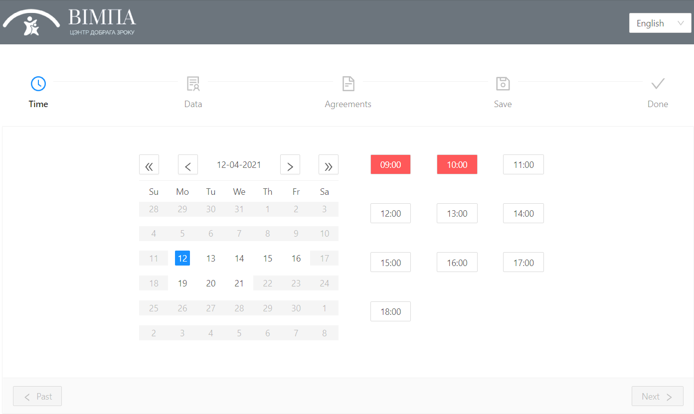
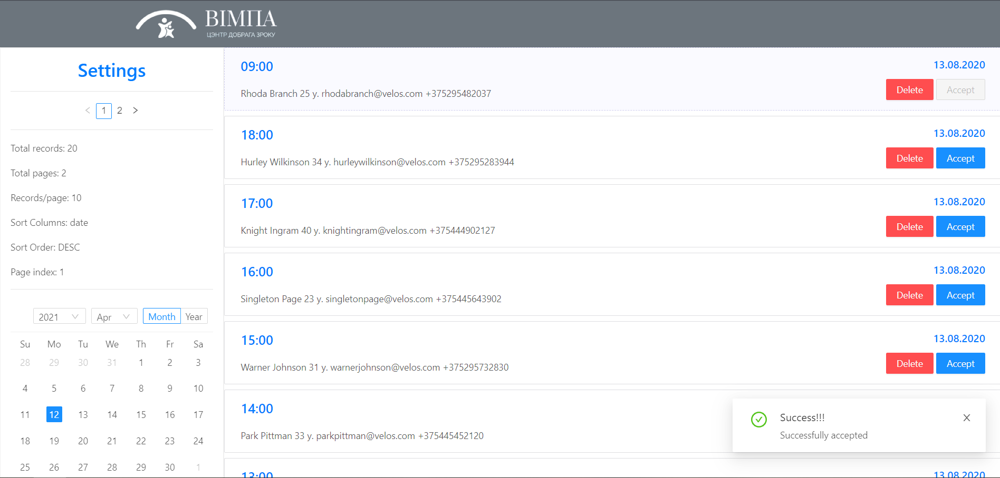

# Medical Office App

[Medical office app](https://register-vimpa.herokuapp.com/) designed to:
1) Allow medical office manage their registration in simple way.
2) Allow Clients make an appointment whenever they want. 

## Related repos

1) [MedicalOfficeApp.API](https://github.com/RI-Software/MedicalOfficeApp.API) - application api.
2) [MedicalOfficeApp.GUI.WEB](https://github.com/RI-Software/MedicalOfficeApp.GUI.WEB) - application web interface.

## Usage 

* As `client` it is as simple as choosing time and  providing some info about yourself.

* 'Manager' can approve or delete, filter or sort clients appointments.

## Stack

ASP.NET Core, EF.Core, JWTs, PostgreSql, Angular 9, NgRX, RxJS.

### Give it a try! :blush: